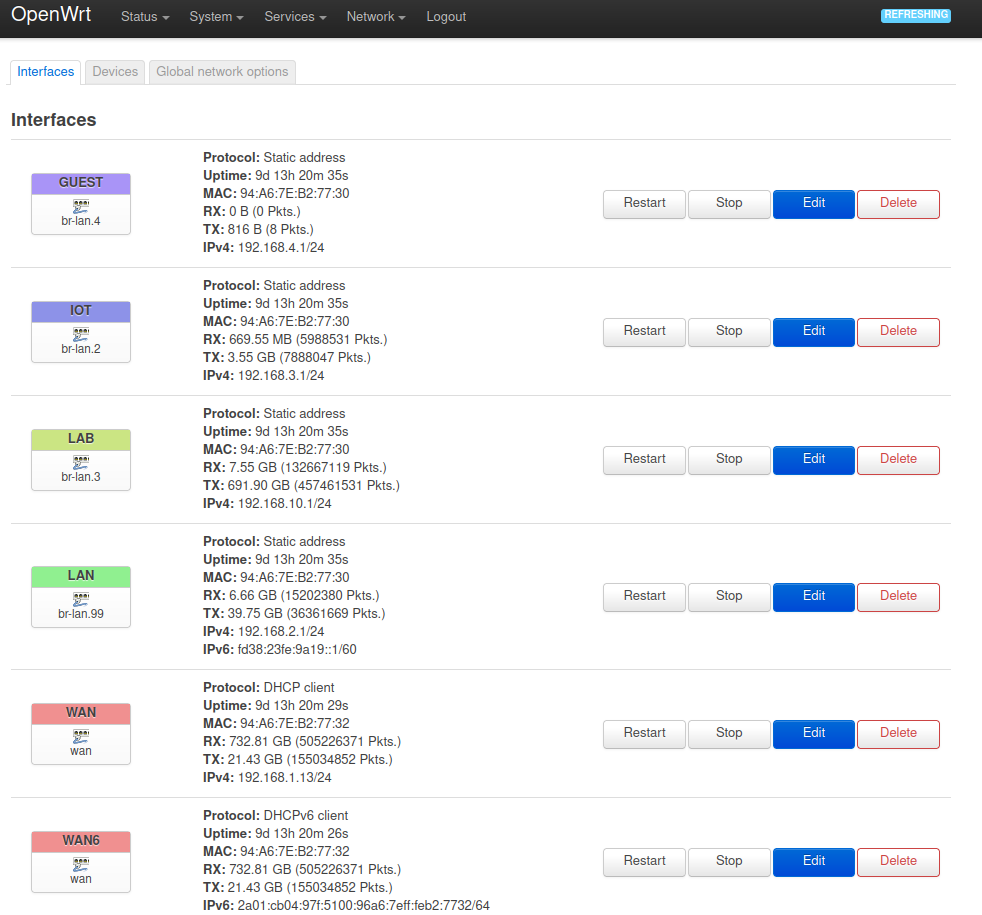
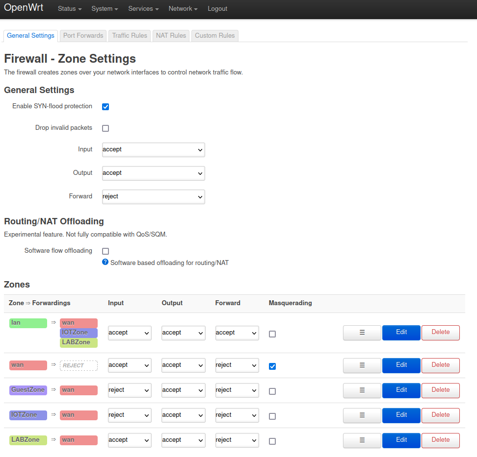
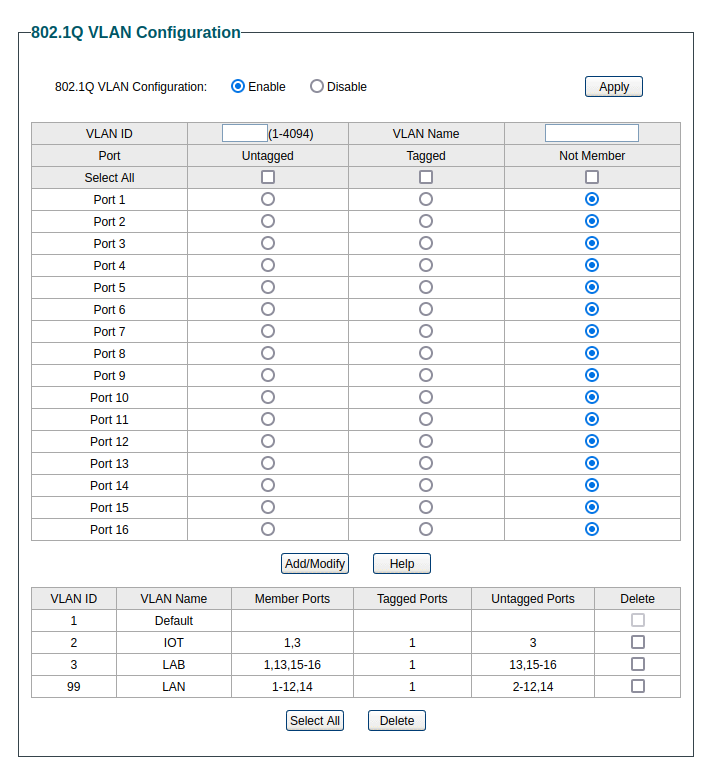
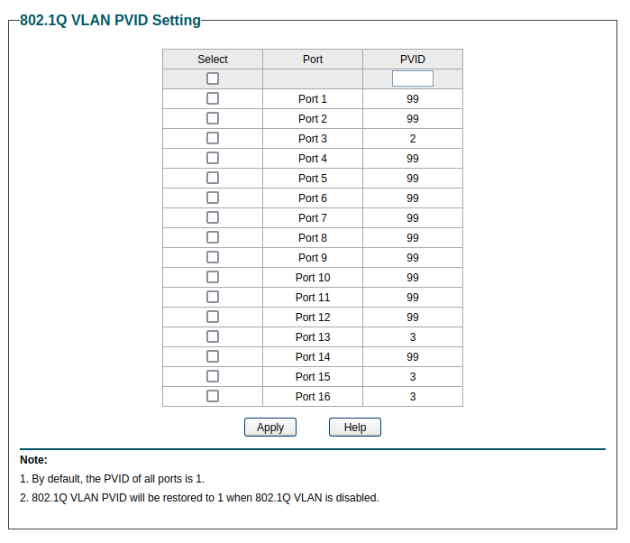

# Setup

## Setup des VLANs sur le default bridge (br-lan)

* t (tagged) : Permet de laisser l'étiquette contenant le VLAN ID dans chaque trame à la sortie du router (cable branché du router vers le switch par ex). Ne fonctionne qu'entre les équipements qui interprette les ID des VLANs dans les trames.
* u (untagged) : Permet de retirer l'étiquette qui contient l'ID du VLAN pour toutes les trames sortant du port. Utile par exemple quand l'équipement branché ne sait pas interpréter les trames avec un ID de VLAN (Ex: Imprimante branché sur un switch)
* \* (Primary Vlan Id) : Permet d'ajouter le VLAN ID pour toutes les trames qui rentre vers l'équipement réseau (Ex: switch). Permet donc à l'équipement branché sur le port de communiquer sur le bon VLAN sans en avoir conscience.

## Setup d'une interface par VLAN
 

## Setup du firewall

## Setup du Switch - VLANs et PVID

