# Documentation d'Architecture DevOps - Services Docker

Ce document a pour objectif de fournir une analyse technique et architecturale complète de l'ensemble des services déployés via Docker Compose sur cette infrastructure. Chaque section est dédiée à une stack applicative, en détaillant ses composants, ses flux réseau, sa persistance de données et sa configuration.

## 1. Stack `analytics`

**Fichier :** `analytics/compose.yml`

### 1.1. Schéma d'Architecture

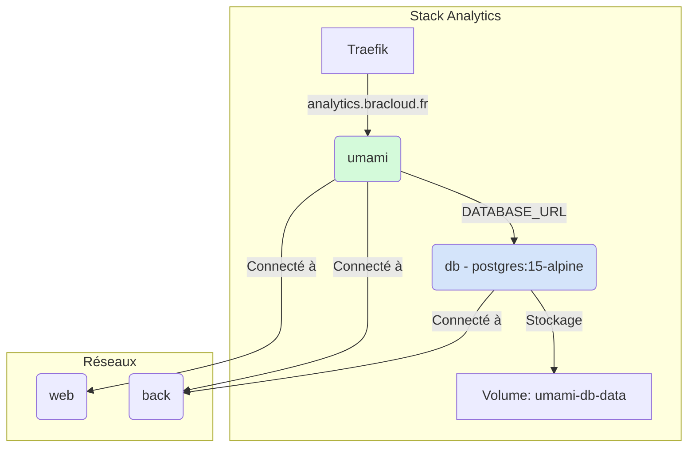

### 1.2. Analyse des Services

#### `umami`
- **Image :** `ghcr.io/umami-software/umami:latest`
- **Rôle :** Service principal de la solution d'analytics Umami. Il expose l'interface web et l'API de collecte de données.
- **Réseaux :**
    - `web`: Pour l'exposition à Internet via le reverse proxy Traefik.
    - `back`: Pour la communication privée avec la base de données.
- **Dépendances :** Dépend de `db` et attend que celui-ci soit sain (`service_healthy`) avant de démarrer, assurant la disponibilité de la base de données.
- **Labels Traefik :**
    - `traefik.enable=true`: Active la gestion par Traefik.
    - `traefik.http.routers.unami.rule=Host(\`analytics.bracloud.fr\`)`: Route le trafic pour `analytics.bracloud.fr` vers ce service.
    - `traefik.http.services.unami.loadbalancer.server.port=3000`: Indique à Traefik que le service écoute sur le port 3000.
- **Variables d'environnement :**
    - `DATABASE_URL`: Chaîne de connexion à la base de données PostgreSQL.
    - `APP_SECRET`: Secret utilisé pour la sécurisation de l'application (sessions, etc.).

#### `db`
- **Image :** `postgres:15-alpine`
- **Rôle :** Base de données PostgreSQL dédiée au service Umami.
- **Réseaux :**
    - `back`: Isolé d'Internet, accessible uniquement par les autres services du même réseau (`umami`).
- **Persistance :**
    - Utilise le volume nommé `umami-db-data` pour stocker les données de la base de manière persistante. Le chemin dans le conteneur est `/var/lib/postgresql/data`.
- **Healthcheck :** Un test `pg_isready` est configuré pour vérifier que la base de données est prête à accepter des connexions, ce qui est crucial pour la condition de démarrage du service `umami`.

### 1.3. Réseaux et Volumes

- **Réseaux :**
    - `web`: Réseau externe, probablement partagé avec Traefik et d'autres services exposés.
    - `back`: Réseau externe, utilisé pour la communication backend sécurisée entre les services.
- **Volumes :**
    - `umami-db-data`: Volume Docker managé, assurant la persistance des données de la base de données PostgreSQL.

## 2. Stack `backup`

**Fichier :** `backup/compose.yml`

### 2.1. Schéma d'Architecture

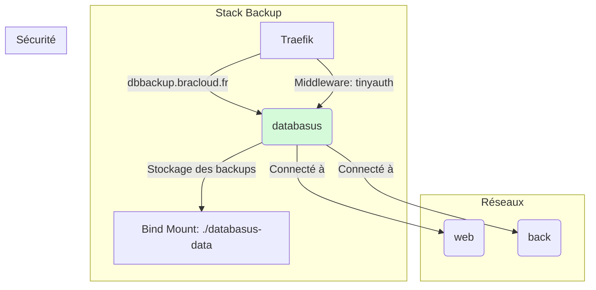

### 2.2. Analyse des Services

#### `databasus`
- **Image :** `databasus/databasus:latest`
- **Rôle :** Application web permettant de gérer et de planifier des sauvegardes de bases de données.
- **Réseaux :**
    - `back`: Pour la communication backend. Bien que le service soit exposé sur le web, il est également sur le `back` pour potentiellement atteindre des bases de données sur ce même réseau.
- **Persistance :**
    - Utilise un "bind mount" (`./databasus-data:/databasus-data`) pour stocker ses données de configuration et les sauvegardes directement sur le système de fichiers de l'hôte, dans le même répertoire que le `compose.yml`.
- **Labels Traefik :**
    - `traefik.enable=true`: Active la gestion par Traefik.
    - `traefik.http.routers.databasus.rule=host(\`dbbackup.bracloud.fr\`)`: Route le trafic pour `dbbackup.bracloud.fr`.
    - `traefik.http.routers.databasus.middlewares=tinyauth`: Applique un middleware d'authentification (`tinyauth`) avant de donner accès au service, sécurisant ainsi l'interface.

### 2.3. Réseaux et Volumes

- **Réseaux :**
    - `web` & `back`: Réseaux externes, configuration standard pour permettre à la fois l'exposition web et la communication backend.
- **Volumes :**
    - **Bind Mount `./databasus-data`**: Ce choix ancre les données de l'application au système de fichiers de l'hôte. C'est pratique pour un accès direct aux fichiers de backup mais moins portable qu'un volume Docker managé.

## 3. Stack `blog`

**Fichier :** `blog/compose.yml`

### 3.1. Schéma d'Architecture

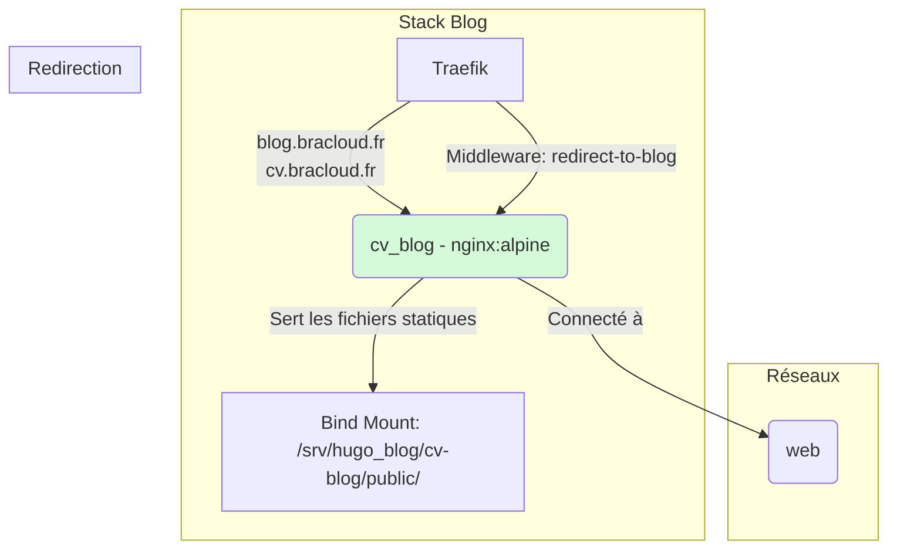

### 3.2. Analyse des Services

#### `cv_blog`
- **Image :** `nginx:alpine`
- **Rôle :** Serveur web Nginx très léger servant un site statique (probablement généré par Hugo, vu le chemin du volume).
- **Réseaux :**
    - `web`: Connecté au réseau `web` pour être accessible depuis Internet via Traefik.
- **Persistance / Contenu :**
    - Le contenu du site est fourni via un bind mount en lecture seule (`ro`) : `/srv/hugo_blog/cv-blog/public/:/usr/share/nginx/html:ro`. Nginx ne fait que servir ces fichiers statiques.
- **Labels Traefik :**
    - **Multi-domaines :** Le routeur `blogcv` gère deux domaines : `cv.bracloud.fr` et `blog.bracloud.fr`.
    - **Redirection permanente (SEO) :** Un middleware de redirection (`redirect-to-blog`) est configuré pour intercepter les requêtes arrivant sur `cv.bracloud.fr` et les rediriger avec un code `301` (permanent) vers `blog.bracloud.fr`, en conservant le chemin de l'URL. C'est une excellente pratique pour le référencement et pour unifier le trafic sur un seul domaine canonique.

### 3.3. Réseaux et Volumes

- **Réseaux :**
    - `web`: Réseau externe pour l'exposition publique.
- **Volumes :**
    - **Bind Mount `/srv/hugo_blog/cv-blog/public/`**: Le conteneur est entièrement stateless. Son seul but est de servir le contenu présent sur l'hôte.

## 4. Stack `dns`

**Fichier :** `dns/compose.yml`

### 4.1. Schéma d'Architecture

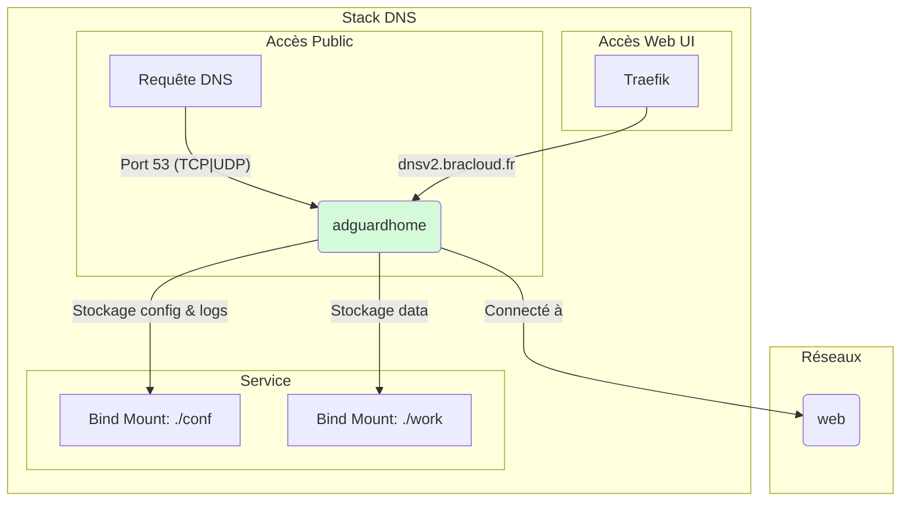

### 4.2. Analyse des Services

#### `adguardhome`
- **Image :** `adguard/adguardhome`
- **Rôle :** Serveur DNS filtrant (bloqueur de publicités, protection contre le pistage). Il remplit deux fonctions :
    1.  **Serveur DNS :** Écoute sur le port `53` de l'IP publique `37.187.136.95` pour résoudre les requêtes DNS.
    2.  **Interface Web :** Expose une interface d'administration gérée par Traefik.
- **Ports :**
    - `37.187.136.95:53:53/tcp` et `37.187.136.95:53:53/udp`: C'est la partie critique. Le service se lie directement au port 53 de l'interface réseau de l'hôte, le rendant accessible publiquement comme un résolveur DNS.
- **Réseaux :**
    - `web`: Permet à Traefik de communiquer avec l'interface web du conteneur.
- **Persistance :**
    - Utilise des bind mounts (`./conf` et `./work`) pour stocker la configuration et les données de travail (logs, statistiques) sur l'hôte.
- **Labels Traefik :**
    - Configure l'accès à l'interface d'administration via l'URL `dnsv2.bracloud.fr` sur le port interne `80` du conteneur.

### 4.3. Réseaux et Volumes

- **Réseaux :**
    - `web`: Réseau externe pour l'accès à l'UI.
- **Volumes :**
    - **Bind Mounts `./conf` et `./work`**: La totalité de l'état de l'application est stockée sur l'hôte, ce qui facilite les sauvegardes et la maintenance de la configuration.

## 5. Stack `download`

**Fichier :** `download/compose.yml`

### 5.1. Schéma d'Architecture

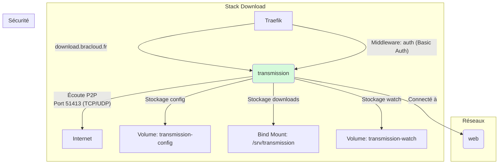

### 5.2. Analyse des Services

#### `transmission`
- **Image :** `lscr.io/linuxserver/transmission:latest`
- **Rôle :** Client BitTorrent avec une interface web.
- **Ports :**
    - `51413:51413` (TCP/UDP): Port exposé directement sur l'hôte pour le trafic peer-to-peer (P2P) du protocole BitTorrent.
- **Réseaux :**
    - `web`: Pour l'accès à l'interface web via Traefik.
- **Persistance :**
    - `transmission-config`: Volume managé pour la configuration.
    - `/srv/transmission:/downloads`: Bind mount pour stocker les fichiers téléchargés. C'est un point clé, car cela rend les fichiers directement accessibles sur l'hôte et potentiellement par d'autres services (ex: Plex, Jellyfin).
    - `transmission-watch`: Volume managé pour le répertoire "watch" où l'on peut déposer des fichiers `.torrent` pour qu'ils soient automatiquement ajoutés.
- **Labels Traefik :**
    - Expose le service sur `download.bracloud.fr`.
    - **Sécurité :** L'accès à l'interface web est protégé par un middleware d'authentification basique (`auth`) qui requiert un nom d'utilisateur et un mot de passe.
- **Environnement :**
    - `PUID=1001`, `PGID=1001`: Assure que les fichiers créés par le conteneur ont les bons droits de propriété sur l'hôte.

### 5.3. Réseaux et Volumes

- **Réseaux :**
    - `web`: Réseau externe.
- **Volumes :**
    - **Mix de volumes managés et de bind mount :** C'est une stratégie courante. Les volumes managés pour la configuration interne de l'application et un bind mount pour les données "utiles" (les téléchargements) afin de les partager facilement.
- **Services commentés :** Le fichier contient des sections commentées pour `radarr`, `jackett`, `sonarr`, et `bazarr`, indiquant une possible extension future de la stack vers un système d'automatisation de téléchargement complet.

## 6. Stack `immich`

**Fichier :** `immich/compose.yml`

### 6.1. Schéma d'Architecture

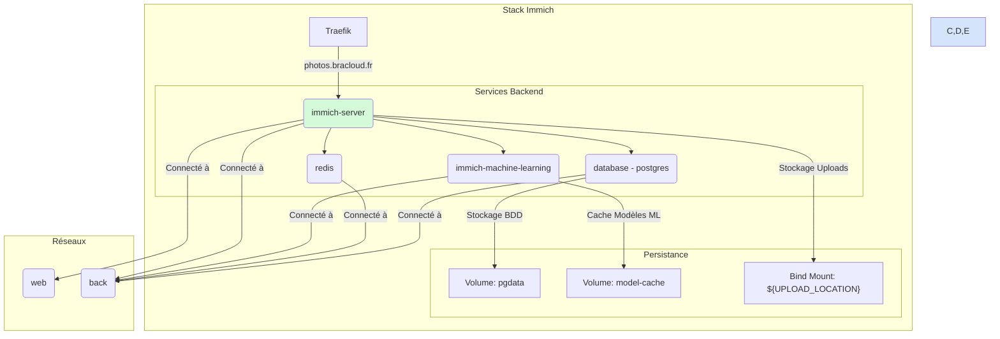

### 6.2. Analyse des Services

Cette stack est une application multi-services complexe pour la gestion de photos et vidéos.

#### `immich-server`
- **Rôle :** Service principal, API et interface web de Immich.
- **Réseaux :** `web` (exposition via Traefik), `back` (communication avec les autres services).
- **Labels Traefik :** Expose le service sur `photos.bracloud.fr` via le port `2283`.
- **Persistance :** Monte le chemin défini par la variable `${UPLOAD_LOCATION}` sur l'hôte pour stocker les fichiers multimédias.
- **Dépendances :** Dépend de `redis` et `database`.

#### `immich-machine-learning`
- **Rôle :** Service dédié aux tâches de Machine Learning (reconnaissance d'objets, classification, etc.).
- **Réseaux :** `back` uniquement, pas d'exposition directe.
- **Persistance :** Utilise le volume `model-cache` pour stocker les modèles de ML et éviter de les retélécharger.

#### `redis`
- **Rôle :** Base de données en mémoire, utilisée pour le caching et la gestion des tâches en file d'attente.
- **Réseaux :** `back` uniquement.

#### `database`
- **Rôle :** Base de données PostgreSQL pour stocker toutes les métadonnées de l'application.
- **Réseaux :** `back` uniquement.
- **Persistance :** Utilise le volume `pgdata` pour la persistance des données de la base.

### 6.3. Réseaux et Volumes

- **Réseaux :** Architecture classique à deux réseaux (`web` et `back`) pour séparer l'exposition publique de la communication interne.
- **Volumes :**
    - `pgdata`, `model-cache`: Volumes managés pour les données internes.
    - **Bind Mount `${UPLOAD_LOCATION}`**: Les fichiers multimédias sont stockés directement sur le système de fichiers de l'hôte, ce qui est essentiel pour une telle application.

## 7. Stack `jellyfin`

**Fichier :** `jellyfin/compose.yml`

### 7.1. Schéma d'Architecture

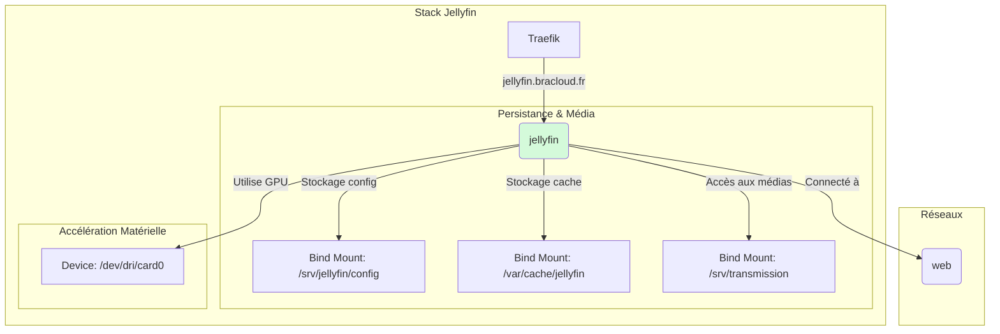

### 7.2. Analyse des Services

#### `jellyfin`
- **Image :** `jellyfin/jellyfin`
- **Rôle :** Serveur multimédia.
- **Réseaux :** `web` pour l'exposition via Traefik.
- **Labels Traefik :** Expose le service sur `jellyfin.bracloud.fr`.
- **Persistance :**
    - `/srv/jellyfin/config`: Stockage de la configuration.
    - `/var/cache/jellyfin`: Stockage du cache.
    - `/srv/transmission:/media`: **Point crucial d'intégration.** Jellyfin a accès en lecture au répertoire de téléchargement de la stack `download`, lui permettant de servir les médias qui y sont présents.
- **Accélération Matérielle :**
    - `devices: - /dev/dri/card0:/dev/dri/card0`: Le conteneur a un accès direct au GPU de l'hôte (`card0`), ce qui est essentiel pour le transcodage vidéo matériel, améliorant considérablement les performances.

### 7.3. Réseaux et Volumes

- **Réseaux :** `web` pour un accès simple.
- **Volumes :** Utilisation exclusive de bind mounts pour un contrôle total et un partage facile des données (médias) entre les stacks.

## 8. Stack `karakeep-app`

**Fichier :** `karakeep-app/compose.yml`

### 8.1. Schéma d'Architecture

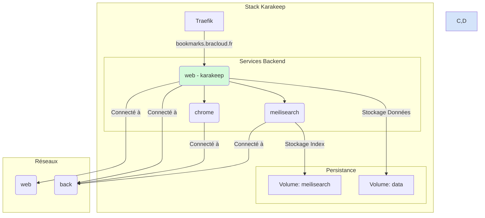

### 8.2. Analyse des Services

#### `web`
- **Image :** `ghcr.io/karakeep-app/karakeep:${KARAKEEP_VERSION:-release}`
- **Rôle :** Service principal de l'application de gestion de favoris Karakeep.
- **Réseaux :** `web` et `back`.
- **Labels Traefik :** Expose le service sur `bookmarks.bracloud.fr`.
- **Persistance :** Utilise le volume `data` pour stocker ses données.

#### `chrome`
- **Image :** `gcr.io/zenika-hub/alpine-chrome:124`
- **Rôle :** Instance de Google Chrome headless (sans interface graphique). Elle est probablement utilisée par le service `web` pour effectuer des tâches de scraping ou de rendu de pages web (par exemple, pour générer des archives ou des miniatures des favoris).
- **Réseaux :** `back` uniquement.
- **Commandes :** Les options de commande (`--no-sandbox`, etc.) sont typiques pour faire fonctionner Chrome dans un environnement conteneurisé.

#### `meilisearch`
- **Image :** `getmeili/meilisearch:v1.13.3`
- **Rôle :** Moteur de recherche rapide et pertinent, utilisé par le service `web` pour indexer et rechercher dans les favoris.
- **Réseaux :** `back` uniquement.
- **Persistance :** Utilise le volume `meilisearch` pour stocker ses index de recherche.

### 8.3. Réseaux et Volumes

- **Réseaux :** Architecture `web`/`back` standard.
- **Volumes :** Utilisation de volumes managés (`meilisearch`, `data`) pour une gestion des données internes à la stack.

## 9. Stack `mkdoc`

**Fichier :** `mkdoc/compose.yml`

### 9.1. Schéma d'Architecture

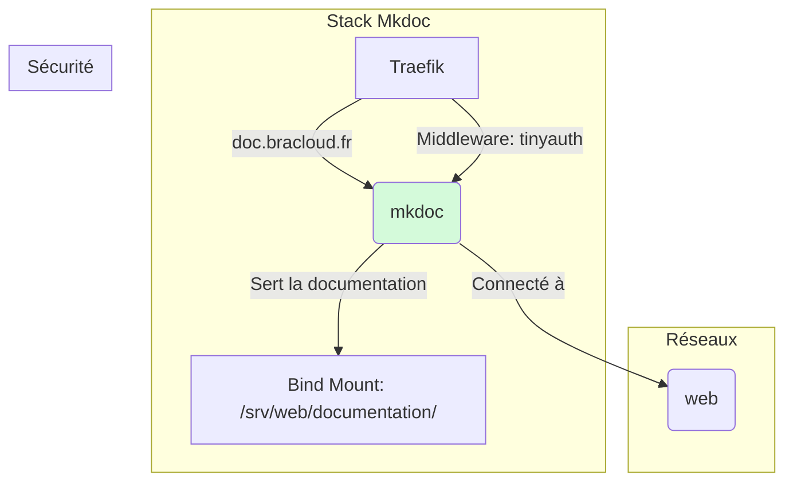

### 9.2. Analyse des Services

#### `mkdoc`
- **Image :** `mkdocs`
- **Rôle :** Serveur de développement pour MkDocs, servant un site de documentation statique.
- **Réseaux :** `web`.
- **Persistance / Contenu :** Le contenu de la documentation est monté via un bind mount depuis `/srv/web/documentation/`.
- **Labels Traefik :**
    - Expose le service sur `doc.bracloud.fr`.
    - **Sécurité :** L'accès est protégé par le middleware `tinyauth`.

### 9.3. Réseaux et Volumes

- **Réseaux :** `web` pour l'exposition publique.
- **Volumes :** Un bind mount unique pour le contenu, le conteneur est stateless.

## 10. Stack `plex`

**Fichier :** `plex/compose.yml`

### 10.1. Schéma d'Architecture

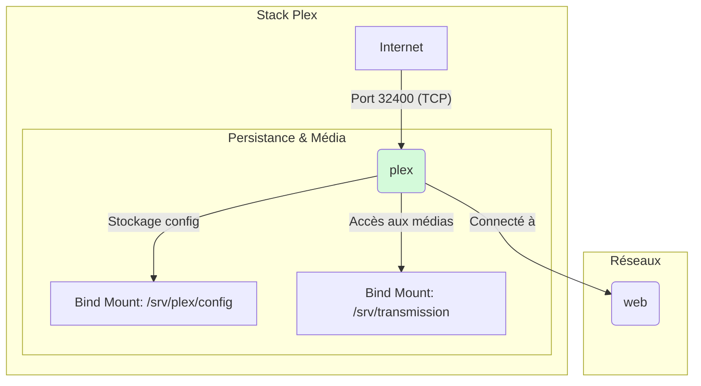

### 10.2. Analyse des Services

#### `plex`
- **Image :** `linuxserver/plex`
- **Rôle :** Serveur multimédia Plex.
- **Ports :**
    - `32400:32400/tcp`: **Exposition directe.** Contrairement à d'autres services, Plex expose son port principal directement sur l'hôte. Cela est souvent nécessaire pour la fonctionnalité "Plex Remote Access" qui peut avoir des difficultés à travers un reverse proxy comme Traefik pour certains types de connexions.
- **Réseaux :** `web`.
- **Persistance :**
    - `/srv/plex/config`: Stockage de la configuration.
    - `/srv/transmission:/data`: **Intégration clé.** Comme Jellyfin, Plex a accès aux fichiers téléchargés par la stack `download`.
- **Environnement :**
    - `PLEX_CLAIM`: Utilisé pour lier cette nouvelle instance de serveur à un compte Plex lors de la première installation.

### 10.3. Réseaux et Volumes

- **Réseaux :** `web`.
- **Volumes :** Bind mounts pour un contrôle total et le partage de médias.

## 11. Stack `prometheus-stack`

**Fichier :** `prometheus-stack/compose.yml`

### 11.1. Schéma d'Architecture

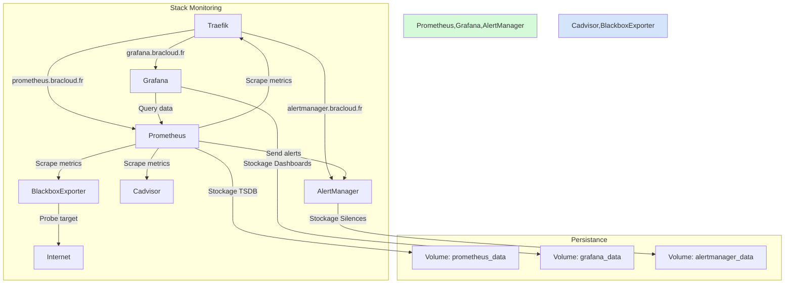

### 11.2. Analyse des Services

Cette stack est une solution de monitoring et d'alerting complète.

#### `prometheus`
- **Rôle :** Base de données de séries temporelles (TSDB) qui collecte et stocke des métriques.
- **Persistance :** Utilise le volume `prometheus_data` et des bind mounts pour les fichiers de configuration (`prometheus.yml`, `rules.yml`).
- **Labels Traefik :** Exposé sur `prometheus.bracloud.fr` et sécurisé par `tinyauth`.

#### `grafana`
- **Rôle :** Outil de visualisation pour créer des dashboards à partir des données de Prometheus.
- **Persistance :** Volume `grafana_data` pour les dashboards, plugins, etc.
- **Labels Traefik :** Exposé sur `grafana.bracloud.fr` et sécurisé par `tinyauth`.

#### `alertmanager`
- **Rôle :** Gère les alertes envoyées par Prometheus. Il les déduplique, les groupe et les route vers les bons destinataires (email, Slack, etc.).
- **Persistance :** Volume `alertmanager_data` pour son état (ex: silences).
- **Labels Traefik :** Exposé sur `alertmanager.bracloud.fr` et sécurisé par `tinyauth`.

#### `cadvisor`
- **Rôle :** Exporte des métriques sur l'utilisation des ressources (CPU, mémoire, réseau...) de tous les conteneurs Docker en cours d'exécution sur l'hôte.
- **Privilèges :** Tourne en mode `privileged` et monte plusieurs répertoires sensibles de l'hôte (`/`, `/sys`, `/var/run`, `/var/lib/docker`) pour pouvoir collecter ces informations.

#### `blackbox`
- **Rôle :** "Blackbox Exporter". Permet de sonder des endpoints (HTTP, TCP, ICMP...) pour vérifier leur disponibilité et performance de l'extérieur. Prometheus scrape le Blackbox Exporter, qui à son tour sonde la cible.

### 11.3. Réseaux et Volumes

- **Réseaux :** `web` et `back` pour une segmentation correcte.
- **Volumes :** Mix de volumes managés pour les données et de bind mounts pour les configurations, ce qui est une pratique standard et robuste pour ce type de stack.

## 12. Stack `seafile`

**Fichier :** `seafile/compose.yml`

### 12.1. Schéma d'Architecture

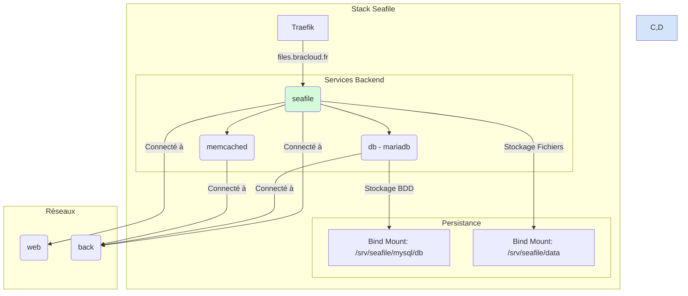

### 12.2. Analyse des Services

#### `seafile`
- **Image :** `seafileltd/seafile-mc:11.0-latest`
- **Rôle :** Service principal de la solution de synchronisation de fichiers Seafile.
- **Réseaux :** `web` et `back`.
- **Labels Traefik :** Expose le service sur `files.bracloud.fr`.
- **Persistance :** Utilise un bind mount `/srv/seafile/data` pour stocker les bibliothèques de fichiers.
- **Dépendances :** Dépend de `db` et `memcached`.

#### `db`
- **Image :** `mariadb:10.11`
- **Rôle :** Base de données MariaDB (équivalent open-source de MySQL).
- **Réseaux :** `back` uniquement.
- **Persistance :** Utilise un bind mount `/srv/seafile/mysql/db` pour la persistance des données.

#### `memcached`
- **Rôle :** Système de caching en mémoire pour accélérer les performances de l'application Seafile.
- **Réseaux :** `back` uniquement.

### 12.3. Réseaux et Volumes

- **Réseaux :** `web` et `back`.
- **Volumes :** Utilisation de bind mounts pour un contrôle total sur l'emplacement des données critiques (fichiers et base de données).

## 13. Stack `traefik`

**Fichier :** `traefik/compose.yml`

### 13.1. Schéma d'Architecture

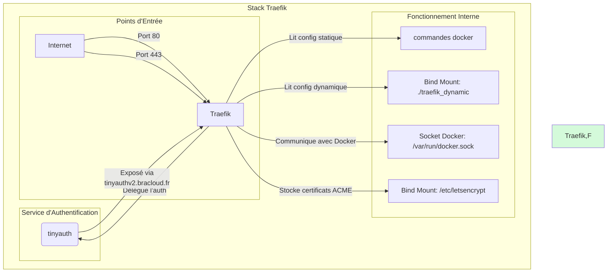

### 13.2. Analyse des Services

C'est la stack la plus critique, car elle sert de reverse proxy pour presque toutes les autres.

#### `traefik`
- **Image :** `traefik:v3.6`
- **Rôle :** Reverse proxy et répartiteur de charge. Il route le trafic entrant vers les bons services en se basant sur les noms de domaine.
- **Ports :**
    - `80:80` et `443:443`: Expose les ports HTTP et HTTPS standards pour recevoir tout le trafic web.
- **Commandes (Configuration Statique) :**
    - **Providers :** `docker` (pour détecter automatiquement les autres conteneurs) et `file` (pour des configurations dynamiques manuelles dans `/traefik_dynamic`).
    - **EntryPoints :** Définit les points d'entrée `web` (port 80) et `websecure` (port 443).
    - **Redirection :** Configure une redirection globale de HTTP vers HTTPS.
    - **ACME (Let's Encrypt) :** Configure le résolveur de certificats `myresolver` pour obtenir automatiquement des certificats SSL/TLS via Let's Encrypt. Les certificats sont stockés dans `/letsencrypt/acme.json`.
- **Volumes :**
    - `/etc/letsencrypt`: Persistance des certificats SSL.
    - `/var/run/docker.sock:/var/run/docker.sock:ro`: **Crucial.** Permet à Traefik d'écouter les événements Docker (démarrage/arrêt de conteneurs) et de se reconfigurer dynamiquement.
    - `./traefik_dynamic`: Pour les fichiers de configuration dynamiques.
- **Réseaux :** Présent sur les deux réseaux `web` et `back` pour pouvoir communiquer avec tous les services qu'il doit router.

#### `tinyauth`
- **Image :** `ghcr.io/steveiliop56/tinyauth:v3`
- **Rôle :** Service d'authentification centralisé. D'autres services (comme `databasus`, `mkdoc`) sont configurés pour utiliser le middleware `tinyauth`. Lorsqu'une requête arrive pour l'un de ces services, Traefik la transfère d'abord à `tinyauth` pour vérifier si l'utilisateur est authentifié avant de laisser passer la requête.
- **Labels Traefik :**
    - Expose sa propre interface sur `tinyauthv2.bracloud.fr`.
    - Définit le middleware `tinyauth` que les autres services peuvent ensuite utiliser.

### 13.3. Réseaux et Volumes

- **Réseaux :** `web` et `back`.
- **Volumes :** Bind mounts pour la configuration, les certificats et l'accès à la socket Docker.

## 14. Synthèse des Backends Traefik

Ce graphe offre une vue d'ensemble de tous les services exposés via Traefik et les noms de domaine correspondants. Les services nécessitant une authentification spécifique sont également mis en évidence.

```mermaid
graph TD
    subgraph "Reverse Proxy"
        direction LR
        T(Traefik v3.6);
    end

    subgraph "Backends Applicatifs"
        direction LR
        
        subgraph "Services Publics"
            um_d(analytics.bracloud.fr)
            blog_d(blog.bracloud.fr)
            cv_d(cv.bracloud.fr)
            dns_d(dnsv2.bracloud.fr)
            photos_d(photos.bracloud.fr)
            jellyfin_d(jellyfin.bracloud.fr)
            bookmarks_d(bookmarks.bracloud.fr)
            files_d(files.bracloud.fr)
        end

        subgraph "Services Protégés"
            dbbackup_d(dbbackup.bracloud.fr)
            download_d(download.bracloud.fr)
            doc_d(doc.bracloud.fr)
            prometheus_d(prometheus.bracloud.fr)
            grafana_d(grafana.bracloud.fr)
            alertmanager_d(alertmanager.bracloud.fr)
            tinyauth_ui_d(tinyauthv2.bracloud.fr)
        end
    end

    subgraph "Cibles des Routes"
        T --> um(umami)
        T --> blog(cv_blog)
        T --> cv(cv_blog)
        T --> dns(adguardhome)
        T --> photos(immich-server)
        T --> jellyfin(jellyfin)
        T --> bookmarks(karakeep)
        T --> files(seafile)

        T -->|"🔐 Basic Auth"| download(transmission)
        
        subgraph "Protégé par TinyAuth"
            T -->|"🔐"| dbbackup(databasus)
            T -->|"🔐"| doc(mkdoc)
            T -->|"🔐"| prometheus(prometheus)
            T -->|"🔐"| grafana(grafana)
            T -->|"🔐"| alertmanager(alertmanager)
            T -->|"🔐"| tinyauth_ui(tinyauth)
        end
    end
    
    classDef backend fill:#d4fada,stroke:#333,stroke-width:2px;
    class um,blog,cv,dns,photos,jellyfin,bookmarks,files,dbbackup,download,doc,prometheus,grafana,alertmanager,tinyauth_ui backend;
    style T fill:#99f,stroke:#333,stroke-width:4px
```
